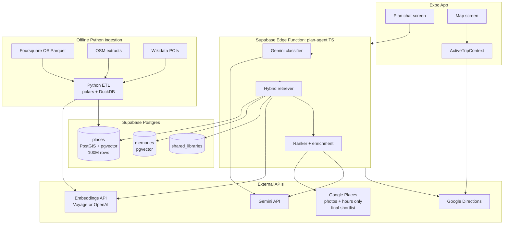

# Full Building Plan: Travel Agent + Places RAG + "Let's Go" Navigation

## TL;DR Answer To Your Two Questions

1. **TypeScript or Python?** Keep the **runtime in TypeScript** (your whole stack already is — Supabase Edge Functions, Expo, Postgres). Use **Python only for the offline ingestion pipeline** (parsing Foursquare/OSM dumps, embedding millions of records). The two never need to talk over the network — Python writes directly into your Supabase Postgres, and the Edge Function reads from it. So "compatibility" is a non-issue: it's a one-shot job, not a service.
2. **How complicated?** With your selected scope (visual-only nav, hybrid catalog), it's **3 well-defined phases over ~2–3 months** of part-time work. Phase 1 is ~1 week, Phase 2 is ~1–2 weeks, Phase 3 is the heavy one (~6–10 weeks). The "millions of places" part is real but bounded once you accept the hybrid trade-off.

## What You Already Have (do not rebuild)

You already have a working AI agent. Treating this as a from-scratch build would waste weeks. Reuse:

- [supabase/functions/plan-agent/index.ts](supabase/functions/plan-agent/index.ts) — Gemini 2.5 Flash classifier with 4 intents (`chat`, `recommend`, `plan`, `plan_with_recommendations`), Google Places text search, Directions waypoint optimization, multi-language support, conversation history, exclude-prior-results.
- [hooks/usePlanAgent.ts](hooks/usePlanAgent.ts) and [app/onboarding/plan.tsx](app/onboarding/plan.tsx) — chat UI with itinerary, recommendations, and hybrid plan cards.
- [lib/routing.ts](lib/routing.ts) — already has `fetchMultiStopRoute` that hits Google Directions with optimized waypoints and decodes the polyline.
- [components/ItineraryCard.tsx](components/ItineraryCard.tsx) — timed multi-stop list, ready to receive a "Let's Go" CTA.

The two big gaps are: **no places retrieval beyond Google** and **no on-map guided execution of the itinerary**.

## Architecture (Target)



**Key design rule:** PostGIS spatial filter runs *before* vector search. You never do a vector scan over 100M rows — you narrow to a few thousand candidates inside a radius + category, then re-rank with cosine similarity. This is what makes the system feasible.

## Phase 1 — "Let's Go" Visual Navigation (~1 week)

Goal: tap a button on the itinerary card, switch to the map, see the full route in colored segments, step through each leg with Start / Continue.

### Backend changes (small)
- Upgrade [lib/routing.ts](lib/routing.ts) `fetchMultiStopRoute` to also return **per-leg polylines**, not just the single `overview_polyline`. Google's Directions response already contains `routes[0].legs[i].steps[j].polyline.points` — concatenate per leg.
- Return shape becomes: `{ ok: true, fullCoordinates, legs: [{ from, to, coordinates, distanceMeters, durationSeconds }] }`.

### New frontend pieces
- New `context/ActiveTripContext.tsx` — holds `{ stops: PlanStop[], legs: LegPolyline[], currentLegIndex, status: 'idle'|'started'|'arrived'|'done' }`.
- New `components/ActiveTripPanel.tsx` — bottom sheet on the map: shows current/next stop, Start, Continue, Skip, End trip.
- "Let's Go" button on [components/ItineraryCard.tsx](components/ItineraryCard.tsx) that pushes the itinerary into `ActiveTripContext` and routes to the Map tab.

### Map rendering changes
In [app/onboarding/Home.tsx](app/onboarding/Home.tsx), render N polylines instead of one:

- legs `[0..currentLegIndex-1]` → gray (completed)
- leg `currentLegIndex` → blue solid (active)
- legs `[currentLegIndex+1..]` → light blue dashed (upcoming)

Per-stop numbered markers with category icon (reuse `CATEGORY_ICON` from [components/ItineraryCard.tsx](components/ItineraryCard.tsx)).

### Stepwise behavior
On Start/Continue tap: set `currentLegIndex++`, animate the camera with `mapRef.current.fitToCoordinates(legs[currentLegIndex].coordinates, { edgePadding })`. Optional v1.1: `Location.watchPositionAsync` + Haversine to auto-prompt "Arrived?" when within 30m of next stop.

### Pros / cons of this phase
- **Pros:** very low risk, all client-side, you keep Waze for actual driving via existing `openDrivingInWaze`. Ships in days. Zero new backend services.
- **Cons:** user still navigates by eye. No turn-by-turn voice. (You explicitly chose this scope, so this is fine.)

## Phase 2 — Personal-Data RAG (~1–2 weeks)

Before the giant catalog, get the personalization win that's actually unique to your app. The agent should know about your saved memos and your friends' shared libraries when it recommends.

### Database
New migration `supabase/migrations/xxxx_pgvector_memories.sql`:

```sql
create extension if not exists vector;
alter table memories add column if not exists embedding vector(1024);
create index on memories using hnsw (embedding vector_cosine_ops);
```

(1024 dims for Voyage-2; use 1536 for OpenAI text-embedding-3-small.)

### Embedding write path
On memory create/update in [hooks/useMemoryCRUD.ts](hooks/useMemoryCRUD.ts), enqueue an embedding job — easiest is a Postgres trigger → `pg_net` POST to a new Edge Function `embed-memory` that calls Voyage and writes back. Async, doesn't block UX.

Embedding text: `${title}. ${description}. ${placeName} in ${country}.`

### Retrieval in plan-agent
In [supabase/functions/plan-agent/index.ts](supabase/functions/plan-agent/index.ts), before calling `searchNearbyPlaces`, run a vector query against the user's memories + libraries they're a member of. If a saved memo matches the query above a similarity threshold, surface it as a "from your memos" section above Google results.

### Pros / cons
- **Pros:** Immediate UX moat. Cheap (Voyage ~$0.02 per 1M tokens, your memos are tiny). Stays inside Supabase. Reuses existing tables.
- **Cons:** Won't help for queries about places the user has never been. (That's what Phase 3 is for.)

## Phase 3 — Hybrid Owned Catalog (~6–10 weeks)

This is the big one. Selected scope: own the retrieval + ranking, call Google only for photos and opening hours of the **final 5–10 shortlisted places per query**. Cuts Google API spend ~95% and gives you semantic queries Google's text search can't do.

### Data sources (free, liberal license)
- **Foursquare Open Source Places** — ~100M places, Apache 2.0, includes categories. Available as Parquet on AWS S3 + Hugging Face. Refreshed quarterly.
- **OpenStreetMap** via Geofabrik regional extracts — fills gaps, ODbL license.
- **Wikidata POIs** — multilingual names, Wikipedia descriptions, CC0/CC-BY-SA. Crucial for landmarks.

### Schema
New migration `supabase/migrations/xxxx_places_catalog.sql`:

```sql
create extension if not exists postgis;
create extension if not exists vector;

create table places (
  id text primary key,                        -- "fsq:xxx" / "osm:way/123" / "wd:Q42"
  source text not null,
  name text not null,
  geom geography(Point, 4326) not null,
  country text,
  city text,
  categories text[] not null,                 -- normalized FSQ taxonomy
  primary_category text,
  description text,                           -- from Wikidata or built from tags
  embedding vector(1024) not null,
  popularity_score real default 0,            -- proxy: Wikipedia pageviews, OSM importance, FSQ rating
  raw jsonb,
  updated_at timestamptz default now()
);

create index places_geom_idx on places using gist (geom);
create index places_category_idx on places using gin (categories);
create index places_embedding_idx on places using hnsw (embedding vector_cosine_ops);
```

### Python ingestion pipeline
Lives in `scripts/ingest/` — does NOT run in production, runs on your laptop or a one-off Cloud Run job:

- `download_fsq.py` — pulls Foursquare Open Source Places Parquet from S3.
- `normalize.py` — uses **Polars** + **DuckDB** to merge FSQ + OSM + Wikidata into the unified schema, dedupe by name+geo proximity (within 50m).
- `embed.py` — batched embedding via Voyage API (`voyage-2`, 1024 dims, async), 1000 places per request.
- `upload.py` — `psycopg` `COPY` into Postgres in chunks of 50k rows.

Why Python here and not TS:
- Polars/DuckDB read 100GB Parquet files in minutes; Node.js can't.
- `voyageai` and `openai` Python SDKs have proper async batching.
- This script runs once + monthly refresh, never touches the live app.

### Cost estimate (one-time)
- Foursquare OS dataset: free (you pay storage to download, ~$5 egress).
- Embeddings: 100M places × ~30 tokens avg × Voyage-2 at $0.12/1M tokens = **~$360**.
- Storage: ~200GB raw + ~150GB embeddings (int8 quantized) = pick a Supabase tier or move places to a dedicated managed Postgres (~$80/month for sufficient size).
- Monthly refresh: ~$50/month embeddings on deltas + ~$30/month compute.

### Runtime query path (in TS Edge Function)
Replace `searchNearbyPlaces` in [supabase/functions/plan-agent/index.ts](supabase/functions/plan-agent/index.ts) with `searchOwnedPlaces`:

```typescript
// 1. Embed the query
const qVec = await embedQuery(searchQuery);

// 2. Spatial + category prefilter, vector re-rank
const { data } = await supabase.rpc('search_places', {
  q_embedding: qVec,
  q_lat: lat, q_lng: lng,
  q_radius_m: 5000,
  q_categories: categoriesFromIntent,
  q_limit: 20,
});

// 3. Hydrate top 5 with Google (photos + today's hours only)
const top5 = data.slice(0, 5);
const hydrated = await Promise.all(top5.map(hydrateWithGoogle));
```

The `search_places` RPC is a SQL function:

```sql
select id, name, ST_Y(geom::geometry) as lat, ST_X(geom::geometry) as lng, ...
from places
where ST_DWithin(geom, ST_MakePoint(q_lng, q_lat)::geography, q_radius_m)
  and categories && q_categories
order by embedding <=> q_embedding
limit q_limit;
```

This is the "PostGIS first, vector second" rule. Vector scan is over a few thousand candidates, not 100M. p95 latency target ~150ms.

### Pros / cons
- **Pros:** ~95% Google API spend cut. Semantic queries beyond text matching ("non-touristy romantic spots with a view"). You own the data. Personalization layer (Phase 2) plugs in trivially. Foursquare OS data is genuinely good for category coverage.
- **Cons (be honest):**
  - **Photos:** bulk dumps don't ship usable photos. Hybrid keeps Google for that, but if Google ever raises prices for Place Details, you still pay for the 5–10 hydration calls per query. Mitigation: aggressively cache photo refs for 30 days per place.
  - **Hours:** static dumps go stale fast. Same hybrid mitigation — only hydrate the shortlist.
  - **Freshness:** restaurants close ~10–20% per year. You need a "report this place is closed" UI + monthly delta refresh.
  - **Storage cost:** real and recurring.
  - **Ratings:** FSQ OS does not ship ratings for non-FSQ places. Use Wikipedia pageviews / OSM importance / your own users' interactions as the popularity signal. Add Google rating only on the hydrated shortlist.

## Why TypeScript Everywhere (Except Ingestion)

You already have an idiomatic Deno/TS Edge Function with proper conversation memory, intent classification, and waypoint optimization. Switching the runtime to Python would mean:

- New service to deploy (Render/Railway/Fly.io ~$10–25/mo) instead of free Edge Functions.
- New auth surface — verify Supabase JWTs in Python.
- Network hop: app → Python → Postgres adds ~50–150ms per call.
- Lose Deno cold-start advantage.
- Rewrite ~900 lines of working code.

The myth that "RAG needs Python" comes from people doing custom ML training or running local models. You aren't — your embeddings are a hosted API, your LLM is Gemini, your vector store is pgvector. All of those have first-class TS clients.

**When you would add a Python service later (not now):**
- Custom reranker model (e.g., Cohere Rerank or a fine-tuned cross-encoder running on a GPU).
- Fine-tuning your own embedding model on user click data.
- Heavy graph orchestration via LangGraph (TS port exists but is a year behind).

If those happen, the integration is dead simple: deploy the Python service somewhere, the Edge Function makes one HTTP call, shared secret in env var. No fundamental architecture change.

## Comparative Pros/Cons Summary

**Stay 100% TS (recommended)**
- Pros: One language, one deploy target, free Edge tier, lowest latency, reuses ~all existing code.
- Cons: Slightly less mature LangChain.js / LlamaIndex.ts.

**Add Python service alongside (not now)**
- Pros: Best ML ecosystem if you actually need it.
- Cons: New infra, new auth, network hop, monthly bill, code split.

**Replace TS with Python (do not do this)**
- Pros: Theoretical "ML-first" stack.
- Cons: Throw away working code, two months of zero feature shipping, all the cons above.

**Keep using Google Places (status quo)**
- Pros: Zero new infra, photos + hours always fresh.
- Cons: Bills scale with usage, no semantic search, no personalization, no ownership.

**Full replacement of Google (rejected per your answer)**
- Pros: Zero ongoing API spend.
- Cons: Photos / hours / closure tracking become your ops problem, ~10× the work.

**Hybrid (your selection)**
- Pros: ~95% spend cut, photos/hours stay fresh, you own the retrieval intelligence.
- Cons: Two systems to keep healthy; need a place hydration cache layer.

## Recommended Order And Timeline

1. **Phase 1** Let's Go visual nav — week 1. Ships a flagship feature with no backend risk.
2. **Phase 2** Personal-data RAG — weeks 2–3. Unique UX moat.
3. **Phase 3a** Catalog ingestion (Python script + schema) for **one city or country first** — weeks 4–6. Validates the pipeline at 100k rows before 100M.
4. **Phase 3b** Switch agent to hybrid retrieval for that region — week 7.
5. **Phase 3c** Scale to global Foursquare OS dump — weeks 8–10.
6. **Phase 3d** Monthly refresh job + closure-reporting UI — week 11+.

## Open Risks Worth Flagging Now

- **Foursquare OS license** — Apache 2.0 is permissive but requires attribution. Add a credits screen.
- **OSM ODbL** — share-alike clause: derived geographic databases distributed publicly must also be ODbL. You're not redistributing the DB, just querying it from your backend, so this is OK; double-check with a lawyer before any data export feature.
- **Google ToS** — caching Place Details and photos has a 30-day limit per their TOS (last I checked). Your hybrid path stays inside that, but document it.
- **Embedding model lock-in** — switching from 1024-dim Voyage to 1536-dim OpenAI later means re-embedding 100M rows (~$360 + a day of compute). Pick once, ideally Voyage-2 (multilingual, cheaper, longer context).
- **PostGIS + pgvector + 100M rows on Supabase** — Supabase's hosted Postgres can handle this only on higher tiers. Benchmark on a 1M-row subset first; if p95 isn't under 200ms, plan to move `places` to a dedicated managed Postgres (Neon, RDS) and keep Supabase for app data.