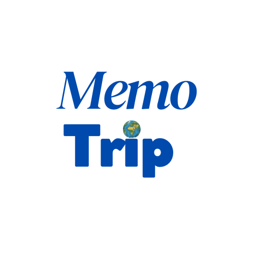
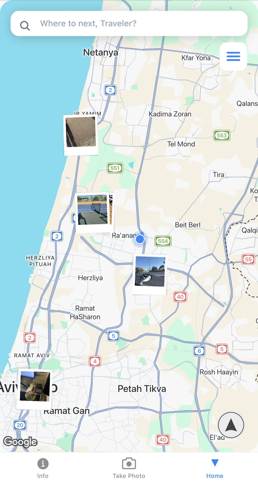
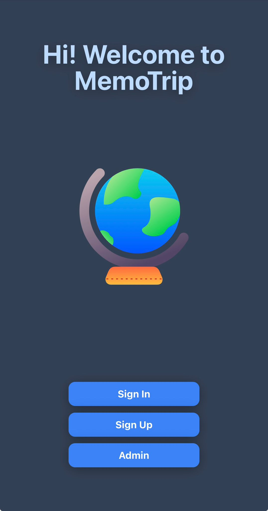

# 📸 Memo_trip
### *Your Journey, Captured on the Map.*

**Memo_trip** is a mobile travel scrapbook that turns your photos into an interactive map. Instead of scrolling through a flat gallery, you can see exactly where your memories happened, relive your routes, and manage your travel highlights in a custom "Scrapbook" style.

---

## ✨ Features

* **Scrapbook Map:** Photos appear as custom Polaroid-style markers with vintage date stamps and organic "tossed" tilts.
* **Memory Gallery:** A dedicated "Memo Pics" slide-up gallery that organizes all your captures in a clean 3-column grid.
* **Teleport Navigation:** Tap any photo in the gallery to "fly" the map directly to that memory's location.
* **Travel Routing:** Get real-time walking directions from your current location to any saved memory using Google Maps API.
* **Privacy-First:** Secure authentication and cloud storage powered by **Supabase**.
* **Dark Mode:** A custom-designed "Dark Forest" map theme for nighttime exploring.

---

## 🖼️ Preview

|                             Logo                             |                         Map                         |
|:------------------------------------------------------------:|:---------------------------------------------------:|
|  |  |

|                      Entry Menu                      |                      Settings Menu                       |
|:----------------------------------------------------:|:--------------------------------------------------------:|
|  |  |

---

## 🛠️ Tech Stack

* **Frontend:** React Native (Expo)
* **Styling:** NativeWind (Tailwind CSS)
* **Map Engine:** React Native Maps & Google Maps API
* **Backend/Database:** Supabase (Auth, PostgreSQL, Storage)
* **Icons:** Expo Vector Icons (Ionicons)

---

---

## 🛠️ Roadmap & Future Features

I am actively developing **Memo_trip** to turn it from a personal scrapbook into a collaborative travel platform. Upcoming milestones include:

* **Social Memory Sharing:** Implement a "cloning" system where users can invite friends via email to copy a specific memory directly into their own map database.
* **Collaborative Trips:** Shared map layers where multiple users can contribute photos to the same trip itinerary in real-time.
* **Media Support:** Expand beyond static photos to include short video "Memory Clips" and voice memos attached to markers.
* **Advanced Filtering:** Ability to filter memories by date ranges, "Trip Folders," or specific travelers.
* **Push Notifications:** Alerts for when a friend shares a new memory with you or when you are physically near a "Saved Memory" location.
* **Offline Mode:** Local caching of map tiles and memories for travelers exploring areas with limited data connectivity.

