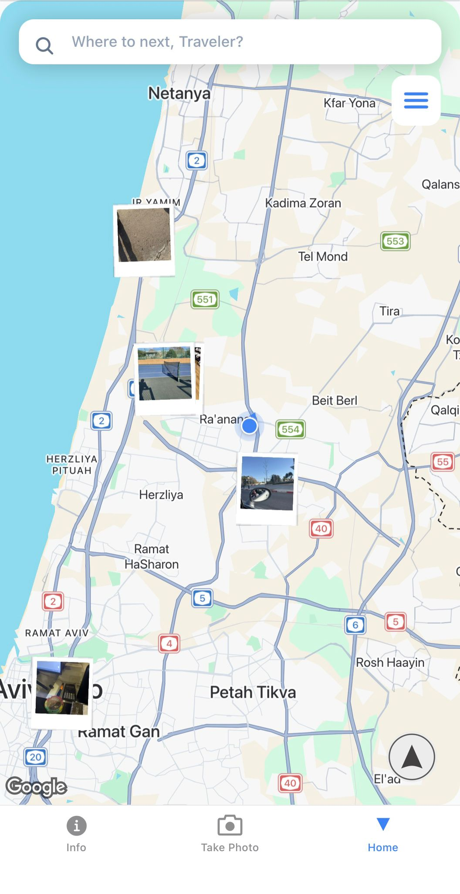
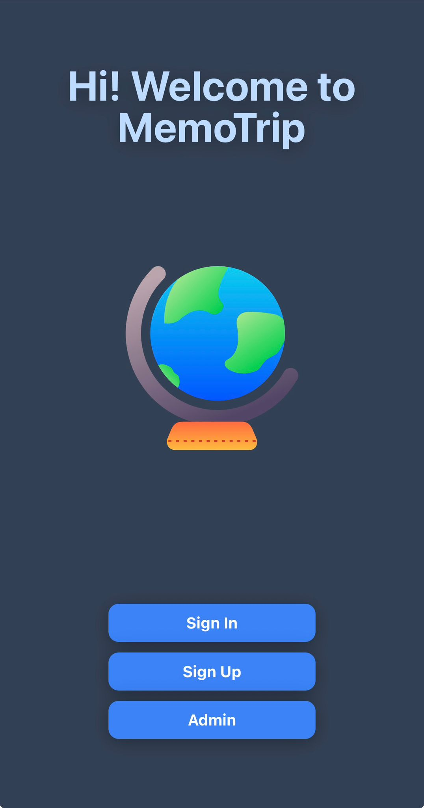
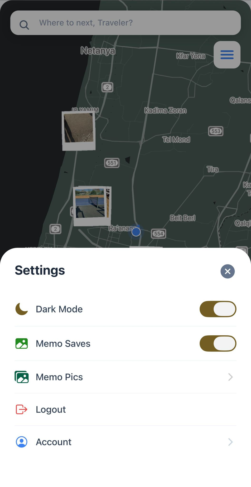

# Memo Trip

Mobile app for capturing geotagged photo memories, viewing them on a map, and organizing them in libraries. Built with **Expo (SDK 54)**, **React Native**, and **Supabase**.

## What it does

- **Map (Home):** Interactive map (`react-native-maps`, Google provider) with thumbnail markers for your memories and for memories shared via **shared libraries** (viewer role). Optional dark map styling from settings.
- **Places:** Search with Google Places, preview a walking route to a selected place, and save a place as a memory (including optional description when no place photo exists).
- **Camera:** **Take Photo** tab launches the camera (`expo-image-picker`); new shots are geotagged and synced to Supabase storage and the `memories` table.
- **Libraries:** Country-based grouping plus **custom folders** (Supabase `libraries` / `library_memos` / `library_members`). Open **My Memos** from settings for a folder-first library UI; **Show on map** filters markers to a folder.
- **Sharing:** Share a single memory by email, or share a custom library with another user; incoming shares appear as shared library memories on the map.
- **Auth:** Email/password sign-in via Supabase Auth; session handled in `AuthContext`. Entry stack: welcome → login/sign-up → onboarding tabs when signed in.

## Screenshots (examples)

Static examples from an earlier build (UI may differ slightly in the current app):

| Logo | Map |
|:---:|:---:|
|  |  |

| Entry | Settings |
|:---:|:---:|
|  |  |

## App structure (high level)

| Area | Notes |
|------|--------|
| `app/` | Expo Router: `index` (welcome), `Login`, `SignUp`, `onboarding/` (tabs: `Home`, `info`, `TakePicture`) |
| `components/` | `LibraryModal`, `SearchBar`, `SettingsSheet`, modals for memo info, sharing, place description |
| `context/` | `AuthContext`, `MemoryProvider` (memories, folders, CRUD, sharing hooks) |
| `hooks/` | `useMapLogic`, `useMemoryCRUD`, `useLibraries`, `useSharing` |
| `lib/` | Supabase data loading (`memoryApi`), geocoding, routing (walking preview), local meta (`memoryStorage`) |
| `assets/country-photos/` | Images used for country folder cards in the library UI |

## Tech stack

- **Runtime:** React 19, React Native 0.81, Expo ~54  
- **Navigation:** Expo Router 6  
- **UI:** NativeWind (Tailwind-style classes), `@gorhom/bottom-sheet` for settings  
- **Map:** `react-native-maps` (Google Maps)  
- **Images:** `expo-image`  
- **Backend:** Supabase (JS client) for auth, Postgres, and storage  
- **Language:** TypeScript  
- **Lint:** `npm run lint` (Expo ESLint config)

## Setup

1. **Dependencies:** `npm install`
2. **Environment:** Copy `.env.example` to `.env` and set:
   - `EXPO_PUBLIC_SUPABASE_URL` / `EXPO_PUBLIC_SUPABASE_ANON_KEY` — Supabase project (used by `lib/supabase.ts`).
   - `EXPO_PUBLIC_GOOGLE_MAPS_API_KEY` — map, Places, and directions (embed in native builds via `app.config.ts`).
3. **Run:** `npm start`, then Expo Go or a dev build (`npm run android` / `npm run ios`).

## iOS builds (EAS and TestFlight)

The app is configured for **[EAS Build](https://docs.expo.dev/build/introduction/)** (`eas.json`, `app.config.ts`).

1. **Apple Developer Program** account and an app record in App Store Connect (bundle ID must match `app.config.ts`: `com.roytentzer.memotrip` — change it there if you use another ID).
2. **Log in:** `npx eas-cli login` (or use the local `eas-cli` from `npm install`).
3. **Link the project:** `npx eas-cli build:configure` (once; creates/updates the Expo project on expo.dev).
4. **Secrets for production builds:** In the [EAS dashboard](https://expo.dev/) or via `eas secret:create`, set the same `EXPO_PUBLIC_*` variables as in `.env` so cloud builds can read them.
5. **Build for TestFlight:** `npm run eas:build:ios` (production profile: store distribution, suitable for TestFlight after processing).
6. **Submit:** `npm run eas:submit:ios` or upload the `.ipa` with Transporter; then enable **TestFlight** testers in App Store Connect.

Use `npm run eas:build:ios:preview` for **internal** (non–TestFlight) distribution only. See Expo’s iOS submission and TestFlight docs for the full checklist (signing, privacy labels, export compliance).

Native `ios/` and `android/` folders are not committed; EAS Build generates them during the cloud build.

## Scripts

| Command | Purpose |
|---------|---------|
| `npm start` | Expo dev server |
| `npm run android` / `npm run ios` / `npm run web` | Platform targets |
| `npm run lint` | ESLint |
| `npm run eas:build:ios` | EAS production iOS build (TestFlight-ready) |
| `npm run eas:submit:ios` | Submit latest EAS iOS build to App Store Connect |

## Roadmap (directional)

Ideas previously tracked for the product include richer collaboration, media beyond still photos, stronger offline behavior, and notification-driven sharing—treated as future work, not guarantees.
